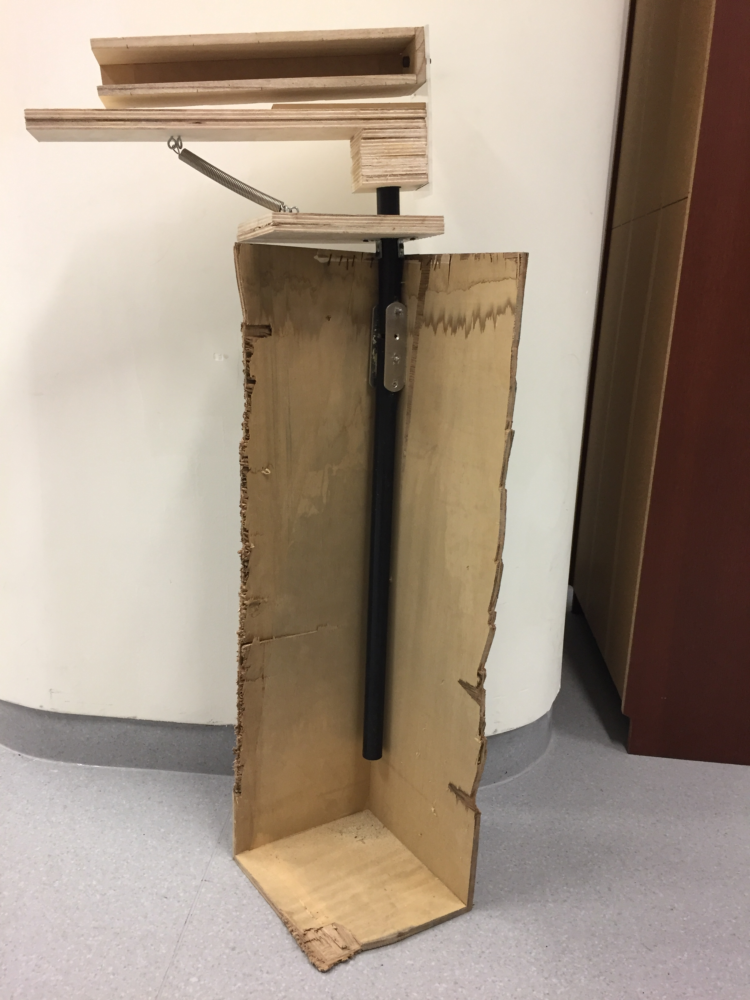

# Skipper

**_SUTD 2019 10.002 Physics I 1D Project (19F07 Group 8)_**

## Inspiration

We were inspired by [Skippa](https://youtu.be/M0_U1FHwACk "Skippa by Mark Rober"), a rock-skipping device built by Mark Rober.

## Design Choices

1. With a budget limit of SGD$60, the clay pigeon thrower used by Mark Rober was out. Thus, we (tried to) build the whole device from scratch. This implies that we utilised a simpler throwing mechanism.
2. Materials used:

  * Plywood and acrylic for the thrower
  * PVC pipes and mahogany wood for the base
  * Polymer clay for the stones

## Final Prototype

    

Our best attempt in terms of number of skips (yep, that's me in the yellow-green T-shirt):

[Bill of materials](./Skipper-BOM.xlsx), [CAD file v1.0](./Skipper-Assembly.step) and [our project report](./Physics_1D_F07-Grp08.pdf) are included in this repository.

Do take note that the spring is not included in the CAD file. The 'Base' part in the CAD file is not essential since it serves only as an anchoring foundation at the beach. Keep in mind that the CAD file is a work-in-progress.

## Acknowledgement

This project was made possible by my professors ([Ching Chee Leong](https://academics.sutd.edu.sg/faculty/ching-chee-leong/ "Ching Chee Leong") and [Kwan Wei Lek](https://epd.sutd.edu.sg/people/faculty/kwan-wei-lek "Kwan Wei Lek")) and my teammates, who supported my crazy initial idea of building this prototype and believed in the project until its completion.
